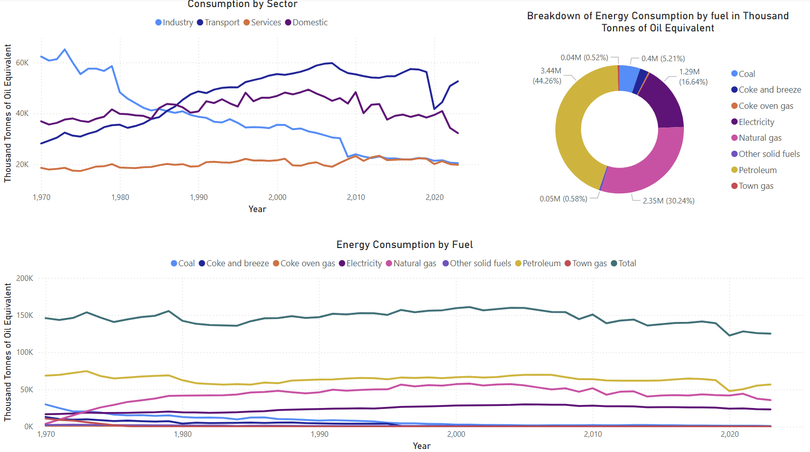
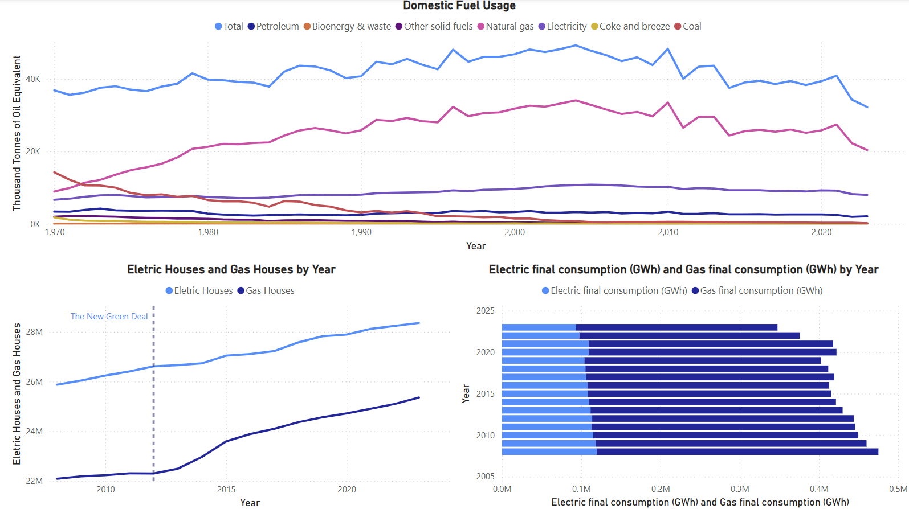
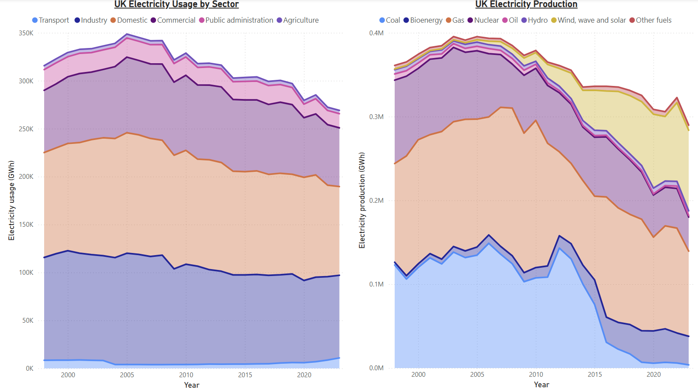
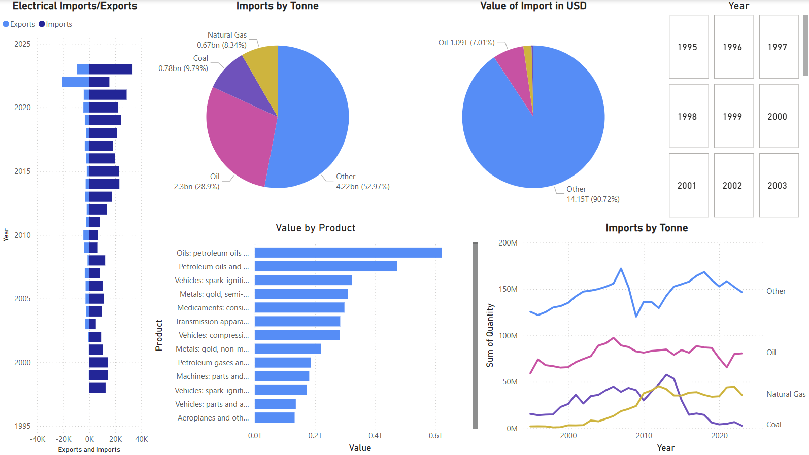
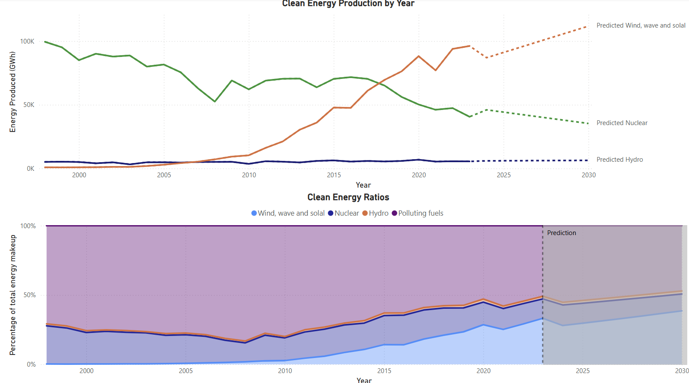

# UK Energy Consumption and Production Analysis

## Project Overview

This project focuses on modeling and analyzing the energy consumption and production of the United Kingdom. The primary goal is to understand how energy is consumed and produced across various sectors, including **Transportation**, **Industry**, **Domestic**, and **Service**. By analysing energy data from different sectors, this project aims to provide insights into trends, energy efficiency, and the overall energy transition in the UK.

Key objectives of the project:
- Model UK energy production and consumption by sector.
- Analyze energy usage trends across sectors.
- Examine the role of renewable and non-renewable energy sources.
- Investigate UK energy imports.
- Identify opportunities for improvement in energy efficiency.
- Visualize energy consumption data for better understanding and decision-making.

## UK Energy Consumption 

From the UK government website data was sourced for the energy consumption in the UK as of 2024. After cleaning and sorting the data the UK energy consumption by sector and by fuel was visualized as seen below.

Analysing the visual data on energy consumption in the UK reveals several key trends in the evolution of energy demand across different sectors: Industry, Service, Domestic, and Transportation. These trends are influenced by a variety of factors, including technological advancements, economic shifts, changes in consumer behavior, and external events like the COVID-19 pandemic. Below is a more detailed examination of these trends and their underlying causes.

### Industrial Sector: Decline in Energy Consumption
The industrial sector shows a clear reduction in energy consumption starting from the late 1970s. This decline is primarily attributed to deindustrialization, a process in which manufacturing and heavy industry declined in importance relative to the service sector. The UK, like many other developed nations, experienced a shift away from labor-intensive industries such as coal mining, steel production, and textiles toward more service-based economic activities.

In addition to deindustrialization, efficiency improvements in manufacturing techniques have contributed significantly to the decrease in energy demand from industry. Over time, advances in technology, automation, and lean production techniques allowed factories to reduce energy consumption while maintaining or even increasing output. Moreover, the closure of energy-intensive factories in the 1980s and 1990s further contributed to the reduced energy consumption by the industrial sector.

By the 2010s, the energy consumption from the industrial sector had declined to levels comparable to that of the service sector, a dramatic shift from earlier decades when industry was the largest energy consumer. This trend highlights the ongoing transformation of the UK economy into a more service-oriented one, where energy consumption is driven more by office buildings, commercial enterprises, and other non-manufacturing activities.

### Service Sector
Unlike the rapid growth observed in other sectors, energy consumption in the service sector has remained relatively steady over the past few decades. This sector, which includes commercial enterprises, office buildings, retail, finance, and healthcare, has seen an increase in energy demand primarily driven by the expansion of office spaces and digital infrastructure.

While the UK economy transitioned away from manufacturing and towards a more service-based model, the energy consumption per unit of service output has not shown the same rapid increase as seen in other sectors like domestic and transportation. This steady consumption can be attributed to several factors such as energy efficiency emprovements, digitalization and remote working.

### Domestic Sector
Energy consumption in the domestic sector has increased over time, closely mirroring the growth in population levels. As the UK’s population grew, so did the demand for energy to meet the needs of households. The increased ownership of household appliances, including refrigerators, washing machines, and eventually televisions, has been a major factor contributing to this rise in energy consumption. Additionally, as living standards improved, the demand for space heating and cooling, particularly with the advent of more sophisticated heating systems, also increased.

The 2000s saw a stabilization in energy consumption per household, due in part to the implementation of energy efficiency measures, such as better insulation, energy-efficient appliances, and the use of low-energy lighting (e.g., LED bulbs). Despite these efficiency gains, the overall domestic energy demand has continued to rise in proportion to population growth, with larger households and increasing appliance use driving continued energy consumption.

### Transportation Sector
The transportation sector has seen the most dramatic increase in energy consumption. Initially, transportation accounted for a smaller portion of the UK’s overall energy use, coming in third behind industry and domestic sectors. However, starting in the late 20th century, transportation consumption began to rise sharply, primarily driven by the increased availability of personal vehicles, expansion of road infrastructure, and the growing accessibility of air travel.

The rise of the automobile and aviation industries, along with an increase in road freight and personal car ownership, led to a rapid growth in energy demand from transportation. Cars became more affordable, and air travel expanded as low-cost airlines emerged in the 1990s and 2000s. As a result, transportation shifted from the third-largest sector in energy consumption to the largest energy-consuming sector in the UK by the early 21st century.

However, the energy consumption pattern in transportation was temporarily disrupted by the COVID-19 pandemic. As lockdowns were implemented across the globe and travel restrictions were enforced, energy consumption from transportation plummeted in 2020. The reduction in car use, air travel, and public transportation during this period had a significant impact on the overall energy consumption data. This brief decline in transportation energy demand was one of the most striking consequences of the pandemic, but it is expected that consumption will eventually recover as travel and commuting patterns return to pre-pandemic levels.

### The Changing Fuel Mix
The fuels consumed across these sectors have also changed dramatically over the decades. In the 1970s, hydrocarbons (such as oil, gas, and coal) were the dominant sources of energy in the UK, and they have continued to play a central role in meeting the country’s energy needs. Oil and gas are still the primary sources of energy for the transportation and domestic sectors, while coal played a significant role in electricity generation and industrial heating until its environmental impact became more apparent.

The use of coal has steadily decreased since the 1980s, largely due to its role as a major pollutant and the growing awareness of its harmful effects on health and the environment. By the 2010s, coal had largely been phased out of electricity generation and industrial processes in favor of natural gas and renewable energy sources. The UK's push to decarbonize its energy sector, along with government policies and international climate agreements, has contributed to a steady decrease in coal consumption.

## Domestic Fuel Usage 

In the UK, gas and electricity have traditionally been the most popular and widely used sources of energy for households. Both fuels play distinct roles in powering homes, with gas primarily used for heating, hot water, and cooking, while electricity is used for lighting, appliances, and electronic devices. Over time, the demand for both energy sources has been shaped by technological advancements, policy changes, and environmental considerations. Below is an in-depth look at how gas and electricity consumption has evolved in UK homes, particularly in light of the Green New Deal and the growing use of gas boilers.
### Gas Energy Consumption
Gas has been the dominant source of energy for home heating and hot water in the UK for several decades. The popularity of gas as a household fuel can be attributed to its relatively low cost, ease of access, and efficiency in central heating systems. In fact, the vast majority of homes in the UK rely on gas boilers for space heating and water heating.The reliance on gas remains significant, and the UK is still far from eliminating its dependence on natural gas in homes. A significant portion of the housing stock, particularly older homes, continues to rely heavily on gas boilers, and replacing these systems with more sustainable alternatives is an expensive and challenging task.
### The Green Deal
The Green Deal, launched in 2012, was one of the most significant government schemes introduced to encourage energy-efficient home improvements. Although it had a broader focus than just gas boilers, it provided financial incentives to install new, energy-efficient heating systems, including gas boilers, as part of a comprehensive approach to improve home insulation and reduce energy consumption. This explains the surge in gas homes in the years prior as the government offered financial Support for energy efficient Improvements and interest free Loans to cover the cost of boiler installations.
### Electricity Consumption in Homes
While gas has been the dominant fuel for heating, electricity consumption in UK households has steadily increased over time, driven by the rise in electrical appliances, lighting, and consumer electronics. Electricity is used to power a wide range of devices in the home, including refrigerators, washing machines, televisions, and computers. Additionally, with the transition to electric heating systems electricity consumption in homes has been on the rise. In line with the Green New Deal and broader environmental goals, there is a growing push to electrify heating in homes, with electric heat pumps, electric radiators, and induction cookers becoming increasingly popular alternatives to gas-powered systems.

## UK Electricity Usage and Production 

This graph compares electricity usage and production in the UK over the years, showing the breakdown of various sectors and energy sources. It is divided into two panels:

### UK Electricity Usage by Sector
This panel shows the electricity consumption by different sectors from around 2000 to 2020. The graph uses stacked areas, where each color represents a different sector.

- **Transport**: The electricity consumption by the transportation sector, which is relatively small compared to other sectors.
- **Industry**: Industrial electricity use, which has been decreasing slightly over time.
- **Commercial**: Represents the commercial sector's electricity usage, with a significant share.
- **Domestic**: Household electricity consumption, which appears to be the largest contributor and seems to decline in recent years.
- **Public** Administration: A relatively small contribution, but it follows a decreasing trend.
- **Agriculture**: Agricultural sector usage, which fluctuates over time but remains low compared to other sectors.
  
Overall, there is a noticeable decline in electricity usage in almost all sectors, especially in domestic, commercial, and industry sectors, suggesting a trend of reducing electricity consumption. The transport sector's electricity use is on the rise, which could reflect the growing adoption of electric vehicles.

###  UK Electricity Production
The right panel shows electricity production, again using stacked areas for different energy sources:

- **Coal**: Coal-based electricity generation, which sharply declines, especially after the mid-2010s, reflecting the UK's efforts to reduce reliance on fossil fuels.
- **Bioenergy**: Electricity from bioenergy, which has steadily increased over time, particularly replacing coal in many cases.
- **Gas**: Gas-based production, which remains relatively stable but does see a slight decrease.
- **Nuclear**: Nuclear energy, which maintains a stable level of contribution to electricity generation.
- **Oil**: Oil-based production, which sees a significant decrease, likely as the UK shifts away from oil for power generation.
- **Hydro**: Hydropower, which shows a stable but relatively small contribution to the overall production.
- **Wind, Wave, and Solar**: Renewable energy sources such as wind, wave, and solar, which have dramatically increased over the years, especially from around 2010 onwards.
- **Other fuels**: A minor contribution, relatively flat over time.

### Key Insights:
Coal, once a dominant source of electricity, has seen a significant decline, reflecting the UK's shift towards cleaner energy sources. Meanwhile, renewable energy sources like wind, wave, and solar power have experienced substantial growth, underscoring the country's transition to renewables. Bioenergy use has also steadily increased, becoming a larger part of the energy mix. Gas and nuclear energy contributions, however, have remained stable, continuing to support the energy supply as renewables expand. In addition, overall electricity consumption has decreased across various sectors, likely driven by improvements in energy efficiency, the adoption of energy-saving technologies, and changes in consumer behavior and energy demands.

The rise in renewable energy, particularly wind, wave, and solar, reflects a growing emphasis on sustainability, while the reduction in coal and oil usage aligns with global efforts to decarbonize and transition away from fossil fuels. Additionally, the decrease in electricity consumption across key sectors suggests improvements in energy efficiency or changes in industrial and consumer behaviors, likely driven by increased energy awareness, efficiency measures, or shifts in the economy.

## Energy Imports 

### Electrical Imports/Exports Bar Graph
This graph shows the balance between the UK’s energy imports and exports from 1995 to 2025. The blue bars represent imports of electricity, while the light blue bars represent exports

Analysis
- The UK has consistently imported more energy than it has exported, with imports growing significantly over time.
- In recent years (especially after 2020), the gap between imports and exports appears to widen, suggesting an increasing dependency on imported energy.
- The steep growth after 2010 and the continuation of this upward trend implies that the UK has been importing increasing amounts of energy, particularly in recent years.

### Imports by Tonnes Pie Chart
This pie chart breaks down UK imports in terms of tonnes from 1995-2023.

- **Oil (28.9%)**: The largest share of imports by weight is from oil, accounting for nearly 29% of total imports.
- **Natural Gas (8.34%)**: A relatively small but significant portion of imports is natural gas, making up just over 8%.
- **Coal (9.79%)**: Coal represents a smaller proportion of energy imports, at just under 10%.
- **Other (52.97%)**: The majority of imports (52.97%) fall under the "Other" category which is all other imports

### Value of Import in USD Pie Chart 
This chart shows the monetary value of these energy imports in USD.

- **Oil (7.01%)**: Despite being the largest import by weight, oil only contributes 7.01% of the import value, indicating that other energy sources are more expensive.
- **Natural Gas (1.86%)**: Natural Gas represents a smaller proportion of energy value due to its cheap price but not as cheap as coal.  
- **Coal (0.42%)**: Coal represents a smaller proportion of energy value due to its cheap price making it the most cost effective.
- **Other (90.72%)**: The majority of the import value is classified under the "Other" category, making up more than 90% of the value.

### Imports by Product Bar Graph 
This graph shows the value of imports by product.

The highest two highest value goods are oil products showing how relient the UK is to oil imports.

### Imports by Tonnes Time Series Graph
This graph shows the quantity of imports in tonnes over the years from **1995 to 2023**. It depicts the trend of imports for each energy source:

- **Oil** : Oil imports show some fluctuations, peaking around 2005 and then stabilizing over time. There's a slight decrease after 2020, but oil remains an important import product for the UK.
- **Natural Gas** : Natural gas imports have been relatively stable, with some small upward and downward fluctuations. This suggests a steady reliance on natural gas for the UK's energy mix.
- **Coal** : Coal imports peaked in the mid-2000s and have sharply decreased in recent years, which aligns with the UK's overall reduction in coal use and efforts to transition to cleaner energy.
- **Other** : This category shows the largest fluctuations. This represents all other imports

### Key Insights
The UK has historically been heavily reliant on oil imports, followed by natural gas, with oil representing a higher volume of imports by weight. However, the value of **Other** products, which includes all non-energy imports, now dominates. Coal imports have significantly decreased, aligning with the UK's efforts to reduce carbon emissions and reduce reliance on fossil fuels. The rising importance of the **Other** category indicates a broader trend towards increasing imports of non-energy goods, while energy imports, such as oil and gas, remain a key focus. Furthermore, the growing gap between imports and exports suggests an increasing reliance on imported energy, likely due to domestic production limitations or a shift towards cleaner energy sources that require external sourcing.

## Clean Energy 
In this analysis, linear regression was used through Python to predict future energy production trends in the UK from 2023 onwards, with the predicted values represented by the dashed lines in the graphs. The line graph displays the energy production (in GWh) for various energy sources, including wind, wave, and solar, nuclear, hydropower, and polluting fuels (coal, gas, oil).

### Clean Energy Production in GWh Time Series Graph 
- **Wind, Wave, and Solar**: This energy source shows a dramatic increase after 2010, with a steep rise from around 2020, reflecting the significant growth in renewable energy, particularly wind and solar power. The UK's heavy investments in these technologies to meet its decarbonization goals are clearly evident, and predictions indicate that wind, wave, and solar energy will continue to rise rapidly in the coming years.
- **Nuclear**: Nuclear energy remains relatively stable, with slight fluctuations observed over time. While it is not expected to see rapid growth, predictions show modest increases in the coming years, as represented by the dashed line, indicating its continued importance in the UK's energy mix.
- **Hydropower**: Hydropower production remains flat and minimal in comparison to wind and nuclear energy, with only minor fluctuations. Predictions suggest slow growth for hydropower, but its contribution to the overall energy mix will remain small.
-**Polluting Fuels**: The use of polluting fuels, such as coal, gas, and oil, has seen a dramatic decline, particularly from around 2010 onwards. This sharp reduction aligns with the UK's energy transition away from fossil fuels, with coal-fired power plants closing and the country shifting toward cleaner, renewable energy sources. The dashed line indicates minimal future use of polluting fuels, in line with the UK’s decarbonization goals.
### Clean Energy Producion Ratio
In the Clean Energy Ratios panel, the stacked area graph shows the percentage contribution of each energy source (wind, nuclear, hydro, and polluting fuels) to total energy production in the UK, highlighting the ongoing transition to clean energy:
- **Wind, Wave, and Solar**: The share of renewable energy from wind, wave, and solar sources has grown significantly, and this trend is expected to continue. By 2030, these renewable sources will become the a dominant contributors to the UK’s energy mix, displacing fossil fuels.
- **Nuclear**: While nuclear's share has remained steady, its contribution is expected to stabilize without significant growth, as renewable sources such as wind and solar take a larger share of the energy mix.
- **Hydropower**: Hydropower remains a small but stable part of the energy mix, and although it will see slight growth, its share will remain minimal compared to other sources of renewable energy.
- **Polluting Fuels**: The proportion of polluting fuels has steadily decreased, and by 2030, fossil fuels are expected to make up a less than half of the energy mix. This decline reflects the UK's ongoing shift away from carbon-intensive energy sources in favor of cleaner, more sustainable options.
### Key Insights
By 2030, wind, wave, and solar energy are expected to dominate the UK's energy mix, with renewable sources making up the majority of energy production. Nuclear energy will maintain a stable role, but its contribution to growth will be modest in comparison to the rapid expansion of renewables. The use of polluting fuels such as coal, oil, and gas is expected to decrease significantly, making up a minimal portion of the energy mix, reflecting the UK's commitment to reducing carbon emissions. Although hydropower will continue to be part of the clean energy mix, its growth potential is limited compared to more scalable sources like wind and solar. Overall, the graph illustrates the UK's ongoing transition to a decarbonized energy system, where wind and solar will lead the way, and fossil fuels will play a very small role.
